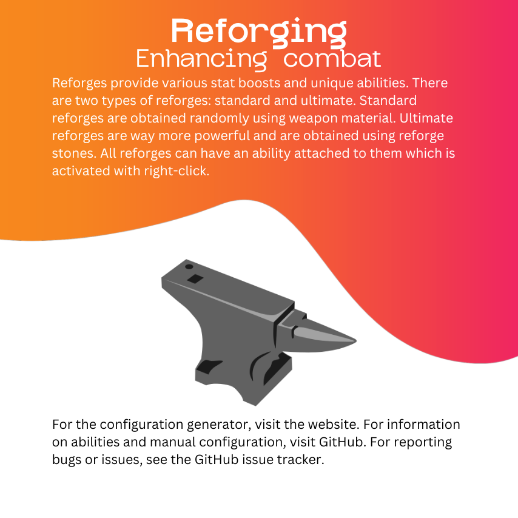
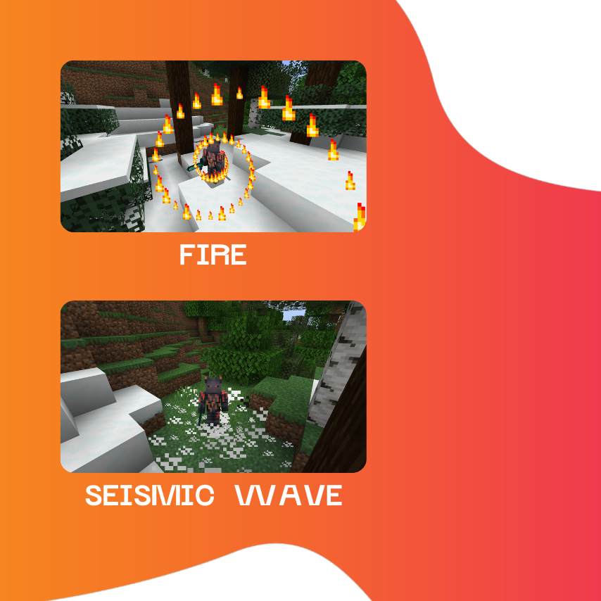
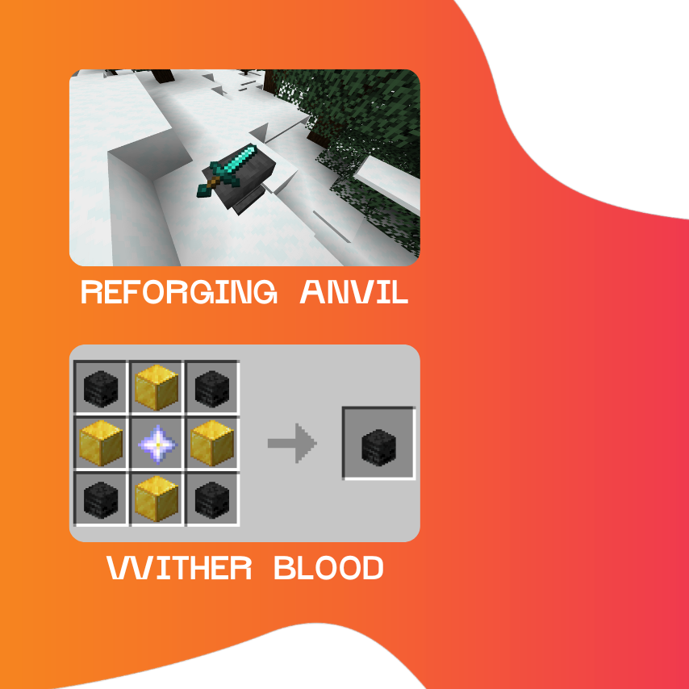
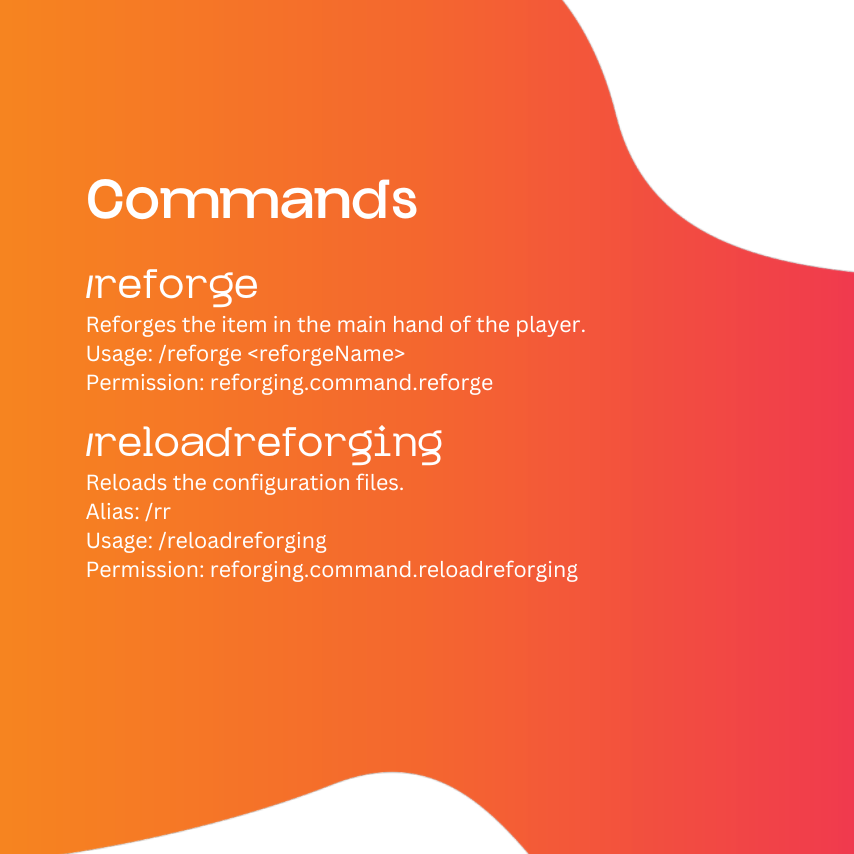

# Overview

[](https://www.spigotmc.org/resources/reforging.105707/)
[](https://reforging.vercel.app/)
[](https://github.com/Aregcraft/reforging)





# Configuration

Specify colors and placeholders with `%COLOR_NAME%` or `%PLACEHOLDER_NAME%` (e.g., `%DARK_BLUE%`, `%REFORGE_NAME%`).

## item.json

Configures the look of reforged items.

### name: string

Specifies the name of reforged items.

Colorized, placeholders:
- **REFORGE_NAME** - the name of the reforge (e.g., "Sharp", "Shielded")
- **NAME** - the name of the item (e.g., "Diamond Sword")

### lore: string list

Specifies the lore attached to the end of reforged items.

Colorized, placeholders:
- **ABILITY** - the ability of the reforge
- **BASE_ATTACK_SPEED** - the base attack speed of the weapon
- **ATTACK_SPEED** - the attack speed provided by the reforge
- **BASE_ATTACK_DAMAGE** - the base attack damage of the weapon
- **ATTACK_DAMAGE** - the attack damage provided by the reforge
- **MAX_HEALTH** - the max health provided by the reforge
- **KNOCKBACK_RESISTANCE** - the knockback resistance provided by the reforge
- **MOVEMENT_SPEED** - the movement speed provided by the reforge
- **ARMOR** - the armor provided by the reforge
- **ARMOR_TOUGHNESS** - the armor toughness provided by the reforge
- **ATTACK_KNOCKBACK** - the attack knockback provided by the reforge

```json
{
  "name": "%RESET%%REFORGE_NAME% %NAME%",
  "lore": [
    "",
    "%GRAY%When right clicked:",
    " %GOLD%%BOLD%%ABILITY% %GOLD%Ability",
    "",
    "%GRAY%When in main hand:",
    "%DARK_GREEN% %BASE_ATTACK_SPEED% %DARK_BLUE%(%ATTACK_SPEED%)%DARK_GREEN% Attack Speed",
    "%DARK_GREEN% %BASE_ATTACK_DAMAGE% %DARK_BLUE%(%ATTACK_DAMAGE%)%DARK_GREEN% Attack Damage",
    "%DARK_BLUE% %MAX_HEALTH% Max Health",
    "%DARK_BLUE% %KNOCKBACK_RESISTANCE% Knockback Resistance",
    "%DARK_BLUE% %MOVEMENT_SPEED% Movement Speed",
    "%DARK_BLUE% %ARMOR% Armor",
    "%DARK_BLUE% %ARMOR_TOUGHNESS% Armor Toughness",
    "%DARK_BLUE% %ATTACK_KNOCKBACK% Attack Knockback"
  ]
}
```

## anvil.json

Configures the look and mechanics of the reforged anvil.

### item

Configures the look of the reforging anvil.

#### name: string

Specifies the name of the reforging anvil.

Colorized, no placeholders.

#### lore: string list

Specifies the lore of the reforging anvil.

Colorized, no placeholders.

### recipe

Specifies the crafting recipe of the reforging anvil.

#### shape: string list

Specifies the shape of the crafting recipe.

#### keys: char to material map

Specifies single-character aliases for materials used in the shape.

### sound

Specifies the sound played when a player is using a reforging anvil.

#### volume: double

Specifies the volume of the sound.

#### pitch: double

Specifies the pitch of the sound.

### price: int

Specifies the amount of the respective ingredient required to use a reforging anvil.

```json
{
  "item": {
    "name": "%DARK_PURPLE%Reforging Anvil",
    "lore": [
      "%GRAY%Place this anvil anywhere in the world",
      "%GRAY%to start reforging items!"
    ]
  },
  "recipe": {
    "shape": [
      "ooo",
      "dad",
      "iii"
    ],
    "keys": {
      "o": "OBSIDIAN",
      "d": "DIAMOND",
      "a": "ANVIL",
      "i": "IRON_BLOCK"
    }
  },
  "sound": {
    "volume": 1,
    "pitch": 0
  },
  "price": 1
}
```

## standard_reforges.json

Configures standard reforges.

### name: string

Specifies the name of the reforge.

### ability: string

Specifies the name of the ability of the reforge.

### [attribute]: float

- **attackSpeed** - the attack speed provided by the reforge
- **attackDamage** - the attack damage provided by the reforge
- **maxHealth** - the max health provided by the reforge
- **knockbackResistance** - the knockback resistance provided by the reforge
- **movementSpeed** - the movement speed provided by the reforge
- **armor** - the armor provided by the reforge
- **armorToughness** - the armor toughness provided by the reforge
- **attackKnockback** - the attack knockback provided by the reforge

### weight: double

Specifies the relative chance of the reforge being applied to the weapon.

<!-- <standard_reforges_json> -->

```json
[
  {
    "name": "Sharp",
    "ability": "NONE",
    "maxHealth": -4,
    "attackDamage": 2,
    "attackSpeed": 0.4,
    "attackKnockback": 2,
    "weight": 40
  },
  {
    "name": "Shielded",
    "ability": "SHIELD",
    "maxHealth": 4,
    "knockbackResistance": 2,
    "attackDamage": -1,
    "armor": 4,
    "armorToughness": 4,
    "weight": 20
  },
  {
    "name": "Infernal",
    "ability": "FIRE",
    "maxHealth": 2,
    "knockbackResistance": 1,
    "attackDamage": -1,
    "armor": 2,
    "attackSpeed": 0.2,
    "weight": 20
  },
  {
    "name": "Murderous",
    "ability": "THROW",
    "attackDamage": 2,
    "attackSpeed": 0.4,
    "weight": 10
  },
  {
    "name": "Enraged",
    "ability": "STORM",
    "maxHealth": -2,
    "attackDamage": 2,
    "attackSpeed": 0.8,
    "weight": 10
  },
  {
    "name": "Stealthy",
    "ability": "TELEPORT",
    "maxHealth": -2,
    "movementSpeed": 0.025,
    "attackDamage": 1,
    "attackSpeed": 0.4,
    "weight": 10
  },
  {
    "name": "Purple",
    "ability": "SHULKER",
    "maxHealth": 2,
    "weight": 10
  },
  {
    "name": "Titanic",
    "ability": "SEISMIC WAVE",
    "maxHealth": 8,
    "movementSpeed": -0.025,
    "attackDamage": -2,
    "attackSpeed": -0.1,
    "armor": 8,
    "weight": 10
  },
  {
    "name": "Wicked",
    "ability": "POTION",
    "maxHealth": 2,
    "attackKnockback": 2,
    "weight": 10
  },
  {
    "name": "Frozen",
    "ability": "FREEZE",
    "movementSpeed": -0.01,
    "attackSpeed": -0.1,
    "armor": 4,
    "weight": 10
  },
  {
    "name": "Illusory",
    "ability": "HIDE",
    "maxHealth": -4,
    "movementSpeed": 0.01,
    "attackSpeed": 0.2,
    "weight": 10
  }
]
```

<!-- </standard_reforges_json> -->

## ultimate_reforges.json

Configures ultimate reforges.

### name: string

Specifies the name of the reforge.

### ability: string

Specifies the name of the ability of the reforge.

### [attribute]: float

- **attackSpeed** - the attack speed provided by the reforge
- **attackDamage** - the attack damage provided by the reforge
- **maxHealth** - the max health provided by the reforge
- **knockbackResistance** - the knockback resistance provided by the reforge
- **movementSpeed** - the movement speed provided by the reforge
- **armor** - the armor provided by the reforge
- **armorToughness** - the armor toughness provided by the reforge
- **attackKnockback** - the attack knockback provided by the reforge

### stone

Configures the reforge stone of this ultimate reforge.

#### name: string

Specifies the name of the reforge stone.

#### item

Configures the look of the reforge stone.

##### name: string

Specifies the name of the reforge stone.

Colorized, no placeholders.

##### lore: string list

Specifies the lore of the reforge stone.

Colorized, no placeholders.

#### material: material

Specifies the material of the reforge stone.

#### recipe

Specifies the crafting recipe of the reforge stone.

##### shape: string list

Specifies the shape of the crafting recipe.

##### keys: char to material map

Specifies single-character aliases for materials used in the shape.

<!-- <ultimate_reforges_json> -->

```json
[
  {
    "name": "Draconian",
    "ability": "DRAGON",
    "maxHealth": 10,
    "attackDamage": 6,
    "armor": 8,
    "armorToughness": 6,
    "attackKnockback": 2,
    "stone": {
      "name": "DRAGON_CLAW",
      "item": {
        "name": "%LIGHT_PURPLE%Dragon Claw",
        "lore": [
          "%GRAY%Use this item on a reforging anvil to",
          "%GRAY%obtain the %GOLD%%BOLD%DRACONIAN %RESET%%GRAY%reforge!"
        ]
      },
      "material": "END_ROD",
      "recipe": {
        "shape": [
          "bdb",
          "ded",
          "bdb"
        ],
        "keys": {
          "d": "DIAMOND",
          "b": "DRAGON_BREATH",
          "e": "ELYTRA"
        }
      }
    }
  },
  {
    "name": "Withered",
    "ability": "WITHER",
    "maxHealth": 12,
    "attackDamage": 8,
    "armor": 4,
    "armorToughness": 3,
    "attackKnockback": 1,
    "stone": {
      "name": "WITHER_BLOOD",
      "item": {
        "name": "%RED%Wither Blood",
        "lore": [
          "%GRAY%Use this item on a reforging anvil to",
          "%GRAY%obtain the %GOLD%%BOLD%WITHERED %RESET%%GRAY%reforge!"
        ]
      },
      "material": "WITHER_SKELETON_SKULL",
      "recipe": {
        "shape": [
          "wgw",
          "gsg",
          "wgw"
        ],
        "keys": {
          "w": "WITHER_SKELETON_SKULL",
          "g": "GOLD_BLOCK",
          "s": "NETHER_STAR"
        }
      }
    }
  },
  {
    "name": "Puppetmaster",
    "ability": "PAWN",
    "maxHealth": 10,
    "attackDamage": -1,
    "armor": 10,
    "stone": {
      "name": "PUPPET",
      "item": {
        "name": "%YELLOW%Puppet",
        "lore": [
          "%GRAY%Use this item on a reforging anvil to",
          "%GRAY%obtain the %GOLD%%BOLD%PUPPETMASTER %RESET%%GRAY%reforge!"
        ]
      },
      "material": "PUFFERFISH",
      "recipe": {
        "shape": [
          "dgd",
          "gng",
          "dgd"
        ],
        "keys": {
          "d": "DIAMOND_BLOCK",
          "g": "GOLD_BLOCK",
          "n": "NETHER_STAR"
        }
      }
    }
  }
]
```

<!-- </ultimate_reforges_json> -->

## abilities.json

Configures abilities.

<!-- <abilities> -->

### DragonAbility

Allows the player to throw a dragon fireball.

#### price

Specifies the amount of health and food taken from the player when activating the ability.

##### health: double

Specifies the amount of health taken from the player when activating the ability.

##### food: int

Specifies the amount of food taken from the player when activating the ability.

#### cooldown: int

Specifies the cooldown of the ability.

#### name: string

Specifies the name of the ability.

#### speed: double

Specifies the speed of the projectile.

### PawnAbility

Allows the player to spawn pawns who will attack other players.

#### price

Specifies the amount of health and food taken from the player when activating the ability.

##### health: double

Specifies the amount of health taken from the player when activating the ability.

##### food: int

Specifies the amount of food taken from the player when activating the ability.

#### attackKnockback: double

Specifies the attack knockback of the pawns.

#### followRange: double

Specifies the follow range of the pawns.

#### count: int

Specifies the number of pawns to spawn.

#### customName: string

Specifies the custom name of the entity.

#### movementSpeed: double

Specifies the movement speed of the pawns.

#### duration: int

Specifies the duration of the lives of the pawns in ticks (1 second = 20 ticks). If 0, the lives of the pawns will not be limited.

#### armorToughness: double

Specifies the armor toughness of the pawns.

#### armor: double

Specifies the armor of the pawns.

#### cooldown: int

Specifies the cooldown of the ability.

#### name: string

Specifies the name of the ability.

#### maxHealth: double

Specifies the health of the pawns.

#### adult: boolean

Specifies whether the entity should be an adult.

#### entity: entity type

Specifies the type of the entity.

#### knockbackResistance: double

Specifies the knockback resistance of the pawns.

#### attackDamage: double

Specifies the attack damage of the pawns.

### HideAbility

Allows the player to become invisible.

#### price

Specifies the amount of health and food taken from the player when activating the ability.

##### health: double

Specifies the amount of health taken from the player when activating the ability.

##### food: int

Specifies the amount of food taken from the player when activating the ability.

#### duration: int

Specifies how long to hide the player in ticks (1 second = 20 ticks).

#### cooldown: int

Specifies the cooldown of the ability.

#### name: string

Specifies the name of the ability.

### PotionAbility

Allows the player to throw a potion.

#### price

Specifies the amount of health and food taken from the player when activating the ability.

##### health: double

Specifies the amount of health taken from the player when activating the ability.

##### food: int

Specifies the amount of food taken from the player when activating the ability.

#### duration: int

Specifies the duration of the effect in ticks (1 second = 20 ticks).

#### effect: potion effect type

Specifies the effect of the thrown potion.

#### cooldown: int

Specifies the cooldown of the ability.

#### name: string

Specifies the name of the ability.

#### amplifier: int

Specifies the amplifier of the effect.

#### speed: double

Specifies the speed of the projectile.

### ShieldAbility

Makes the player immune to attacks from aggressive mobs.

#### price

Specifies the amount of health and food taken from the player when activating the ability.

##### health: double

Specifies the amount of health taken from the player when activating the ability.

##### food: int

Specifies the amount of food taken from the player when activating the ability.

#### function

Specifies the three-dimensional mathematical function used to create visual effects.

##### min: double

Specifies the starting value of t.

##### max: double

Specifies the ending value of t.

##### x: expression

Specifies how much x changes based on t.

##### delta: double

Specifies the step of t.

##### y: expression

Specifies how much y changes based on t.

##### z: expression

Specifies how much z changes based on t.

#### duration: int

Specifies the duration of the ability in ticks (1 second = 20 ticks).

#### disableAttack: boolean

Specifies whether the player should be prevented from attacking other entities.

#### name: string

Specifies the name of the ability.

#### particle: particle

Specifies the particle used to create visual effects.

### SeismicWaveAbility

Allows the player to create a seismic wave knocking back and damaging all entities within range.

#### price

Specifies the amount of health and food taken from the player when activating the ability.

##### health: double

Specifies the amount of health taken from the player when activating the ability.

##### food: int

Specifies the amount of food taken from the player when activating the ability.

#### function

Specifies the two-dimensional mathematical function used to create visual effects.

##### min: double

Specifies the starting value of t.

##### max: double

Specifies the ending value of t.

##### x: expression

Specifies how much x changes based on t.

##### delta: double

Specifies the step of t.

##### z: expression

Specifies how much z changes based on t.

#### duration: int

Specifies the duration of the ability in ticks (1 second = 20 ticks).

#### damage: double

Specifies the damage that is dealt to the entities.

#### name: string

Specifies the name of the ability.

#### range: double

Specifies the range of the ability.

#### particle: particle

Specifies the particle used to create visual effects.

#### speed: double

Specifies the speed at which to knock back the entities.

#### height: double

Specifies the height to which to knock back the entities.

### ThrowAbility

Allows the player to throw their weapon dealing damage to all entities it hits.

#### price

Specifies the amount of health and food taken from the player when activating the ability.

##### health: double

Specifies the amount of health taken from the player when activating the ability.

##### food: int

Specifies the amount of food taken from the player when activating the ability.

#### duration: int

Specifies the duration of the ability in ticks (1 second = 20 ticks).

#### name: string

Specifies the name of the ability.

#### damageFactor: double

Specifies the factory by which to multiply the base damage of the weapon.

#### speed: double

Specifies the speed of the weapon.

### ShulkerAbility

Allows the player to throw a shulker bullet.

#### price

Specifies the amount of health and food taken from the player when activating the ability.

##### health: double

Specifies the amount of health taken from the player when activating the ability.

##### food: int

Specifies the amount of food taken from the player when activating the ability.

#### cooldown: int

Specifies the cooldown of the ability.

#### name: string

Specifies the name of the ability.

#### speed: double

Specifies the speed of the projectile.

### TeleportAbility

Allows the player to teleport in their looking direction.

#### price

Specifies the amount of health and food taken from the player when activating the ability.

##### health: double

Specifies the amount of health taken from the player when activating the ability.

##### food: int

Specifies the amount of food taken from the player when activating the ability.

#### distance: int

Specifies the maximum distance the player can teleport.

#### cooldown: int

Specifies the cooldown of the ability.

#### name: string

Specifies the name of the ability.

### FreezeAbility

Allows the player to throw a snowball, freezing the hit entity.

#### price

Specifies the amount of health and food taken from the player when activating the ability.

##### health: double

Specifies the amount of health taken from the player when activating the ability.

##### food: int

Specifies the amount of food taken from the player when activating the ability.

#### duration: int

Specifies how long to freeze the hit entity in ticks (1 second = 20 ticks).

#### cooldown: int

Specifies the cooldown of the ability.

#### name: string

Specifies the name of the ability.

#### speed: double

Specifies the speed of the projectile.

### StormAbility

Allows the player to strike lighting around them.

#### price

Specifies the amount of health and food taken from the player when activating the ability.

##### health: double

Specifies the amount of health taken from the player when activating the ability.

##### food: int

Specifies the amount of food taken from the player when activating the ability.

#### function

Specifies the two-dimensional mathematical function used to create visual effects.

##### min: double

Specifies the starting value of t.

##### max: double

Specifies the ending value of t.

##### x: expression

Specifies how much x changes based on t.

##### delta: double

Specifies the step of t.

##### z: expression

Specifies how much z changes based on t.

#### cooldown: int

Specifies the cooldown of the ability.

#### name: string

Specifies the name of the ability.

### FireAbility

Allows the player to create a shape (e.g., spiral) and ignite all entities that collide with it.

#### price

Specifies the amount of health and food taken from the player when activating the ability.

##### health: double

Specifies the amount of health taken from the player when activating the ability.

##### food: int

Specifies the amount of food taken from the player when activating the ability.

#### function

Specifies the three-dimensional mathematical function used to create visual effects.

##### min: double

Specifies the starting value of t.

##### max: double

Specifies the ending value of t.

##### x: expression

Specifies how much x changes based on t.

##### delta: double

Specifies the step of t.

##### y: expression

Specifies how much y changes based on t.

##### z: expression

Specifies how much z changes based on t.

#### duration: int

Specifies the duration of burning in ticks (1 second = 20 ticks).

#### cooldown: int

Specifies the cooldown of the ability.

#### name: string

Specifies the name of the ability.

#### particle: particle

Specifies the particle used to create visual effects.

### WitherAbility

Allows the player to throw a wither skull.

#### price

Specifies the amount of health and food taken from the player when activating the ability.

##### health: double

Specifies the amount of health taken from the player when activating the ability.

##### food: int

Specifies the amount of food taken from the player when activating the ability.

#### cooldown: int

Specifies the cooldown of the ability.

#### name: string

Specifies the name of the ability.

#### speed: double

Specifies the speed of the projectile.

<!-- </abilities> -->

<!-- <abilities_json> -->

```json
[
  {
    "name": "SHIELD",
    "type": "Shield",
    "price": {
      "health": 4,
      "food": 4
    },
    "duration": 100,
    "function": {
      "x": "cos(48t)",
      "y": "0.5t",
      "z": "sin(48t)",
      "min": 0,
      "max": 5,
      "delta": 0.25
    },
    "particle": "ENCHANTMENT_TABLE",
    "disableAttack": true
  },
  {
    "name": "FIRE",
    "type": "Fire",
    "price": {
      "health": 2,
      "food": 2
    },
    "cooldown": 20,
    "function": {
      "x": "0.025tcos(t)",
      "y": "0.025tsin(t)",
      "z": "0.005t",
      "min": 0,
      "max": 20,
      "delta": 0.25
    },
    "particle": "FLAME",
    "duration": 60
  },
  {
    "name": "THROW",
    "type": "Throw",
    "price": {
      "health": 1,
      "food": 1
    },
    "duration": 20,
    "damageFactor": 0.75,
    "speed": 0.75
  },
  {
    "name": "STORM",
    "type": "Storm",
    "price": {
      "health": 4,
      "food": 4
    },
    "cooldown": 60,
    "function": {
      "x": "3cos(t)",
      "z": "3sin(t)",
      "min": 0,
      "max": 6.28318530718,
      "delta": 0.34906585039
    }
  },
  {
    "name": "TELEPORT",
    "type": "Teleport",
    "price": {
      "health": 4,
      "food": 4
    },
    "cooldown": 60,
    "distance": 4
  },
  {
    "name": "SHULKER",
    "type": "Shulker",
    "price": {
      "health": 4,
      "food": 4
    },
    "cooldown": 60,
    "speed": 1
  },
  {
    "name": "SEISMIC WAVE",
    "type": "SeismicWave",
    "price": {
      "health": 6,
      "food": 6
    },
    "duration": 10,
    "function": {
      "x": "0.5cos(t)",
      "z": "0.5sin(t)",
      "min": 0,
      "max": 6.28318530718,
      "delta": 0.5
    },
    "particle": "EXPLOSION_NORMAL",
    "range": 5,
    "speed": 0.5,
    "height": 0.5,
    "damage": 4
  },
  {
    "name": "POTION",
    "type": "Potion",
    "price": {
      "health": 4,
      "food": 4
    },
    "cooldown": 40,
    "speed": 0.5,
    "effect": "POISON",
    "duration": 60,
    "amplifier": 2
  },
  {
    "name": "DRAGON",
    "type": "Dragon",
    "price": {
      "health": 8,
      "food": 8
    },
    "cooldown": 100,
    "speed": 4
  },
  {
    "name": "WITHER",
    "type": "Wither",
    "price": {
      "health": 6,
      "food": 6
    },
    "cooldown": 100,
    "speed": 4
  },
  {
    "name": "PAWN",
    "type": "Pawn",
    "price": {
      "health": 6,
      "food": 6
    },
    "cooldown": 200,
    "entity": "ZOMBIE",
    "customName": "%YELLOW%%PLAYER%'s Pawn",
    "adult": true,
    "count": 2,
    "duration": 200,
    "maxHealth": 10,
    "attackDamage": 4,
    "armor": 4
  },
  {
    "name": "FREEZE",
    "type": "Freeze",
    "price": {
      "health": 4,
      "food": 4
    },
    "cooldown": 60,
    "speed": 2,
    "duration": 60
  },
  {
    "name": "HIDE",
    "type": "Hide",
    "price": {
      "health": 8,
      "food": 8
    },
    "cooldown": 100,
    "duration": 200
  }
]
```

<!-- </abilities_json> -->
