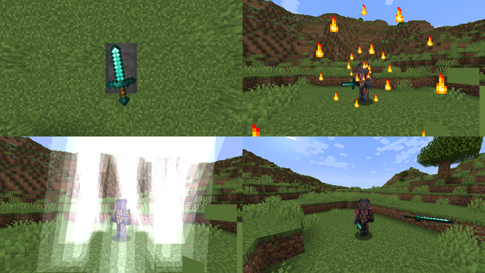

# Reforging

Reforging is a new mechanic for enhancing combat experience. Reforges provide various stat boosts and unique abilities. Reforges are obtained on a reforging anvil using ingredients.

## Why this plugin?

Make your server unique by creating your own reforges from scratch. All abilities are highly customizable with numerous properties.

## Showcase



## Commands

| Name | Description | Permission | Aliases |
| --- | --- | --- | --- |
| /reforge &lt;id&gt; | Reforges the weapon in the main hand of the player | reforging.command.reforge | N/A |
| /reloadreforging | Reloads the configuration files | reforging.command.reloadreforging | /rr |

## Abilities

<!-- <abilities> -->
| Name | Description |
| --- | --- |
| Dash | Allows the player to start a rapid movement in the looking direction |
| Pawn | Allows the player to spawn entities that will attack other players but not them |
| Rage | Allows the player to deal more damage in exchange for receiving its portion |
| Effect | Allows the player to add an effect on themselves |
| Throw | Allows the player to throw their weapon, damaging all hiy entities |
| Reveal | Allows the player to reveal all invisible entities within range |
| Fire | Allows the player to create a spiral in the looking direction (or any other shape) of fire, igniting all touching entities |
| Freeze | Allows the player to throw a snowball (or any other projectile), freezing the hit entity |
| Evoker | Allows the player to summon evoker fangs |
| Explosion | Allows the player to create an explosion around them |
| Projectile | Allows the player to throw a projectile |
| Storm | Allows the player to strike a circle (or any other shape) of lightning bolts around them |
| SeismicWave | Allows the player to create a spiral (or any other shape) around them, damaging and knocking back all entities within the range |
| Shield | Allows the player to create a spiral (or any other shape) around them, protecting them from all entities |
| Teleport | Allows the player to teleport in the looking direction |
| Potion | Allows the player to throw a potion with a custom effect |
<!-- </abilities> -->

## FAQ

### How to get a reforging anvil?

Craft reforging anvil with the configured recipe.

### How to reforge a weapon?

1. Right-click with the weapon on a reforging anvil
2. Right-click with the corresponding ingredient on the reforging anvil

The reforging anvil will consume the configured amount of ingredient(s). The weapon will drop with the reforge applied.

### What are the ingredients?

Most reforges use as an ingredient the material of the weapon (e.g., diamond(s) for a diamond sword). More powerful reforges use unique stones as ingredients.

### How to get a reforge stone?

Craft reforge stones with the configured recipes.

### How to activate an ability?

Right-click with the reforged weapon in your hand.

## Support

If you encounter a bug, please report it on the GitHub issue tracker.

## Configuration

Reforging uses JSON as its configuration language. Please use https://jsonlint.com/ or similar websites to validate your configuration files, as any syntax errors will result in a crash.

### Placeholders

Lots of strings can have colors and placeholders. Specify colors with `%color_name%` or `%#rrggbb%`. Specify placeholders with `%placeholder_name%`.

### Primitives

| Type | Description | Example |
| --- | --- | --- |
| `int` | An integer from $-2^{31}$ to $2^{31}-1$ | `7` |
| `long` | An integer from $-2^{63}$ to $2^{63}-1$ | `9` |
| `double` |A double-precision floating point number | `9.7` |
| `boolean` | Either `true` or `false` | `true` |
| `char` | A character | `"a"` |
| `Object` | Anything | `6` |
| `String` | A sequence of characters | `"Hello, World!"` |
| `Expression` | A mathematical expression | `"2cos(2t)"` |
| `UUID` | A universally unique identifier | `"b74413ae-d8a7-4025-8dc7-60ca8b65f979"` |
| `Enchantment` | An enchantment of the form `"minecraft:id"` | `"minecraft:sharpness"` |
| `PotionEffectType` | A potion effect type of the form `"minecraft:id"` | `"minecraft:strength"` |

### Enumerations

| Type | Values |
| --- | --- |
| `Attribute` | https://hub.spigotmc.org/javadocs/spigot/org/bukkit/attribute/Attribute.html |
| `AttributeModifier.Operation` | https://hub.spigotmc.org/javadocs/spigot/org/bukkit/attribute/AttributeModifier.Operation.html |
| `EquipmentSlot` | https://hub.spigotmc.org/javadocs/spigot/org/bukkit/inventory/EquipmentSlot.html |
| `Material` | https://hub.spigotmc.org/javadocs/bukkit/org/bukkit/Material.html |
| `EntityType` | https://hub.spigotmc.org/javadocs/bukkit/org/bukkit/entity/EntityType.html |

### `List<E>`

```
[E, E, ...]
```

```json
[7, 9]
```

### `Map<K, V>`

```
{
  K: V,
  K: V,
  ...
}
```

```json
{
  "key1": "value1",
  "key2": "value2"
}
```

### `Multimap<K, V>`

```
{
  K: [V, V, ...],
  L: [V, V, ...],
  ...
}
```

```json
{
  "key1": ["value11", "value12"],
  "key2": ["value12", "value22"]
}
```

### `Price`

| Name | Type | Description |
| --- | --- | --- |
| health | `double` | The amount of health |
| food | `int` | The amount of food |

```json
{
  "health": 4.5,
  "food": 4
}
```

### `Function2`

| Name | Type | Description |
| --- | --- | --- |
| x | `Expression` | The x coordinate based on the parameter `t` |
| z | `Expression` | The z coordinate based on the parameter `t` |
| min | `double` | The starting value of the parameter `t` |
| max | `double` | The ending value of the parameter `t` |
| delta | `double` | The step of the parameter `t` |

```json
{
  "x": "3cos(t)",
  "z": "3sin(t)",
  "min": 0,
  "max": 6.28318530718,
  "delta": 0.39269908169
}
```

### `Function3`

| Name | Type | Description |
| --- | --- | --- |
| x | `Expression` | The x coordinate based on the parameter `t` |
| y | `Expression` | The y coordinate based on the parameter `t` |
| z | `Expression` | The z coordinate based on the parameter `t` |
| min | `double` | The starting value of the parameter `t` |
| max | `double` | The ending value of the parameter `t` |
| delta | `double` | The step of the parameter `t` |

```json
{
  "x": "3cos(t)",
  "y": "3sin(t)",
  "z": "1.5t",
  "min": 0,
  "max": 6.28318530718,
  "delta": 0.39269908169
}
```

### `Vector`

| Name | Type | Description |
| --- | --- | --- |
| x | `double` | The x coordinate |
| y | `double` | The y coordinate |
| z | `double` | The z coordinate |

```json
{
  "x": 1.5,
  "y": 4.5,
  "z": 8.5
}
```

### `AttributeModifier`

| Name | Type | Description | Optional | Default |
| --- | --- | --- | --- | --- |
| uuid | `UUID` | The unique identifier  | Yes | Random |
| name | `String` | The name | No | N/A |
| amount | `double` | The amount  | No | N/A |
| operation | `AttributeModifier.Operation` | The operation | Yes | `ADD_NUMBER` |
| slot | `EquipmentSlot` | The equipment slot | Yes | All |

```json
{
  "uuid": "b74413ae-d8a7-4025-8dc7-60ca8b65f979",
  "name": "generic_max_health",
  "amount": 0.5,
  "operation": "MULTIPLY_SCALAR_1",
  "slot": "CHEST"
}
```

### `ItemWrapper`

| Name | Type | Description | Optional | Default |
| --- | --- | --- | --- | --- |
| material | `Material` | The material  | No | N/A |
| amount | `int` | The amount | Yes | `1` |
| name | `String` | The name, can have colors  | Yes | Client-side |
| lore | `List<String>` | The lore, can have colors  | Yes | None |
| enchants | `Map<Enchantment, Integer>` | The enchantments with their levels | Yes | None |
| flags | `ItemFlag` | The flags | Yes | None |
| unbreakable | `boolean` | Whether the item should be unbreakable | Yes | `false` |
| attributeModifiers | `Multimap<Attribute, AttributeModifier>` | The attribute modifiers | Yes | None |
| persistentData | `Map<String, Object>` | The persistent data | Yes | None |

```json
{
  "material": "DIAMOND_SWORD",
  "name": "%gold%Excalibur",
  "lore": ["%gold%A legendary sword!"],
  "enchants": {
    "minecraft:sharpness": 5,
    "minecraft:knockback": 2
  },
  "flags": ["HIDE_UNBREAKABLE"],
  "unbreakable": true,
  "attributeModifiers": {
    "GENERIC_MAX_HEALTH": [
      {
        "name": "generic_max_health",
        "amount": 10
      }
    ]
  },
  "persistentData": {
    "id": "EXCALIBUR"
  }
}
```

### `Recipe`

| Name | Type | Description |
| --- | --- | --- |
| shape | `List<String>` | The shape of the recipe of the form `["aaa", "aaa", "aaa"]`, where letters correspond to some ingredient |
| ingredients | `Map<char, Material>` | The ingredients of the recipe |

```json
{
  "shape": [
    "ddd",
    "ddd",
    "ddd"
  ],
  "ingredients": {
    "d": "DIAMOND"
  }
}
```

### `EntityBuilder`

| Name | Type | Description | Optional | Default |
| --- | --- | --- | --- | --- |
| attributeModifiers | `Multimap<Attribute, AttributeModifiers>` | The attribute modifiers | Yes | None |
| persistentData | `Map<String, Object>` | The persistent data | Yes | None |
| type | `EntityType` | The type  | No | N/A |
| name | `String` | The name, can have colors | Yes | `""` |
| health | `double` | The health  | Yes | Maximum |
| nameVisible | `boolean` | Whether the name should be visible | Yes | `false` |
| gravity | `boolean` | Whether the entity should be affected by gravity | Yes | `true` |
| ai | `boolean` | Whether the entity should have AI | Yes | `true` |
| invisible | `boolean` | Whether the entity should be invisible | Yes |`false` |
| glowing | `boolean` | Whether the entity should glow | Yes | `false` |
| canPickupItems | `boolean` | Whether the entity should be able to pick up items | Yes | `false` |
| visualFire | `boolean` | Whether the entity should look as if it is on fire | Yes | `false` |
| adult | `boolean` | Whether the entity should be an adult | Yes | `false` |
| helmet | `ItemWrapper` | The helmet | Yes | None |
| chestplate | `ItemWrapper` | The chestplate | Yes | None |
| leggings | `ItemWrapper` | The leggings | Yes | None |
| boots | `ItemWrapper` | The boots | Yes | None |
| itemInMainHand | `ItemWrapper` | The item in the main hand | Yes | None |
| itemInOffHand | `ItemWrapper` | The item in the offhand | Yes | None |

```json
{
  "type": "ZOMBIE",
  "name": "%blue%Frozen Baby Zombie",
  "nameVisible": true,
  "gravity": false,
  "ai": false,
  "glowing": true,
  "adult": false,
  "helmet": {
    "material": "LEATHER_HELMET"
  }
}
```

### `item.json`

| Name | Type | Description |
| --- | --- | --- |
| name | `String` | The names of all reforged weapons, can have colors and placeholders |
| lore | `List<String>` | The lore attached to all reforged weapons, can have colors and placeholders |

#### Placeholders

| Name | Description | Example |
| --- | --- | --- |
| reforge_name | The name of the reforge | Withered |
| name | The name of the weapon | Diamond Sword |
| base_attack_speed | The base attack speed of the weapon | 1.6 |
| base_attack_damage | The base attack damage of the weapon | 7 |
| generic_max_health | The max health provided by the reforge | 10 |
| generic_knockback_resistance | The knockback resistance provided by the reforge | 1 |
| generic_movement_speed | The movement speed provided by the reforge | 0.1 |
| generic_armor | The armor provided by the reforge | 5 |
| generic_armor_toughness | The armor toughness provided by the reforge | 3 |
| generic_attack_knockback | The attack knockback provided by the reforge | 1 |

<!-- <item_json> -->
```json
{
  "name": "%reforge_name% %name%",
  "lore": [
    "",
    "%gray%When in Main Hand:",
    "%dark_green% %base_attack_speed% (%generic_attack_speed%) Attack Speed",
    "%dark_green% %base_attack_damage% (%generic_attack_damage%) Attack Damage",
    "%dark_green% %generic_max_health% Max Health",
    "%dark_green% %generic_knockback_resistance% Knockback Resistance",
    "%dark_green% %generic_movement_speed% Movement Speed",
    "%dark_green% %generic_armor% Armor",
    "%dark_green% %generic_armor_toughness% Armor Toughness",
    "%dark_green% %generic_attack_knockback% Attack Knockback"
  ]
}
```
<!-- </item_json> -->

### `reforge_stones.json: List<ReforgeStone>`

| Name | Type | Description |
| --- | --- | --- |
| id | `String` | The identifier of the reforge |
| item | `ItemWrapper` | The item |
| recipe | `Recipe` | The crafting recipe |

<!-- <reforge_stones_json> -->
```json
[
  {
    "id": "WITHERED",
    "item": {
      "material": "WITHER_SKELETON_SKULL",
      "name": "%light_purple%Wither Blood",
      "lore": [
        "%gray%Use this item on a reforging anvil to",
        "%gray%obtain %light_purple%%bold%Withered %reset%%gray%reforge!"
      ]
    },
    "recipe": {
      "shape": [
        "gdg",
        "dnd",
        "gdg"
      ],
      "ingredients": {
        "g": "GOLD_BLOCK",
        "d": "DIAMOND_BLOCK",
        "n": "NETHER_STAR"
      }
    }
  },
  {
    "id": "TITANIC",
    "item": {
      "material": "ZOMBIE_HEAD",
      "name": "%green%Titan Head",
      "lore": [
        "%gray%Use this item on a reforging anvil to",
        "%gray%obtain %green%%bold%Titanic %reset%%gray%reforge!"
      ]
    },
    "recipe": {
      "shape": [
        "odo",
        "ded",
        "odo"
      ],
      "ingredients": {
        "o": "OBSIDIAN",
        "d": "DIAMOND_BLOCK",
        "e": "EMERALD_BLOCK"
      }
    }
  },
  {
    "id": "MURDEROUS",
    "item": {
      "material": "SKELETON_SKULL",
      "name": "%red%Cracked Skull",
      "lore": [
        "%gray%Use this item on a reforging anvil to",
        "%gray%obtain %red%%bold%Murderous %reset%%gray%reforge!"
      ]
    },
    "recipe": {
      "shape": [
        "igi",
        "gwg",
        "igi"
      ],
      "ingredients": {
        "i": "IRON_BLOCK",
        "g": "GOLD_BLOCK",
        "w": "WITHER_SKELETON_SKULL"
      }
    }
  },
  {
    "id": "PUPPETEER",
    "item": {
      "material": "STRING",
      "name": "%green%Puppeteer String",
      "lore": [
        "%gray%Use this item on a reforging anvil to",
        "%gray%obtain %green%%bold%Puppeteer %reset%%gray%reforge!"
      ]
    },
    "recipe": {
      "shape": [
        "cdc",
        "ded",
        "cdc"
      ],
      "ingredients": {
        "c": "COBWEB",
        "d": "DRAGON_BREATH",
        "e": "ELYTRA"
      }
    }
  },
  {
    "id": "EXPLOSIVE",
    "item": {
      "material": "GUNPOWDER",
      "name": "%red%Creeper Gunpowder",
      "lore": [
        "%gray%Use this item on a reforging anvil to",
        "%gray%obtain %red%%bold%Explosive %reset%%gray%reforge!"
      ]
    },
    "recipe": {
      "shape": [
        "gdg",
        "ded",
        "gdg"
      ],
      "ingredients": {
        "g": "GUNPOWDER",
        "d": "DIAMOND_BLOCK",
        "e": "ELYTRA"
      }
    }
  }
]
```
<!-- </reforge_stones_json> -->

### `reforge_weights.json: Map<String, double>`

| Key | Value |
| --- | --- |
| The identifier of the reforge | The relative Weight |

<!-- <reforge_weights_json> -->
<!-- </reforge_weights_json> -->

### `reforges.json: List<Reforge>`

| Name | Type | Description | Optional |
| --- | --- | --- | --- |
| id | `String` | The identifier | No |
| name | `String` | The name | No |
| attributes | `Map<Attribute, double>` | The attributes with their amounts | No |
| ability | `String` | The identifier of the ability | Yes |

<!-- <reforges_json> -->
```json
[
  {
    "id": "WITHERED",
    "name": "%light_purple%Withered",
    "attributes": {
      "GENERIC_MAX_HEALTH": 10,
      "GENERIC_ATTACK_DAMAGE": 10,
      "GENERIC_ATTACK_SPEED": 0.2,
      "GENERIC_ARMOR": 4,
      "GENERIC_ARMOR_TOUGHNESS": 2
    },
    "ability": "WITHER"
  },
  {
    "id": "HEALING",
    "name": "%red%Healing",
    "attributes": {
      "GENERIC_MAX_HEALTH": 8,
      "GENERIC_ATTACK_DAMAGE": 2,
      "GENERIC_ATTACK_SPEED": -0.1,
      "GENERIC_ARMOR": 2
    },
    "ability": "REGENERATION"
  },
  {
    "id": "FROST",
    "name": "%blue%Frost",
    "attributes": {
      "GENERIC_MAX_HEALTH": -2,
      "GENERIC_ATTACK_DAMAGE": 2,
      "GENERIC_ARMOR": 4,
      "GENERIC_MOVEMENT_SPEED": -0.025
    },
    "ability": "FREEZE"
  },
  {
    "id": "OUTRAGEOUS",
    "name": "%red%Outrageous",
    "attributes": {
      "GENERIC_MAX_HEALTH": -4,
      "GENERIC_ATTACK_DAMAGE": 4,
      "GENERIC_ATTACK_SPEED": 0.2,
      "GENERIC_MOVEMENT_SPEED": 0.025
    },
    "ability": "RAGE"
  },
  {
    "id": "CLOUDY",
    "name": "%gray%Cloudy",
    "attributes": {
      "GENERIC_MAX_HEALTH": -4,
      "GENERIC_ATTACK_DAMAGE": 6,
      "GENERIC_ATTACK_SPEED": 0.1
    },
    "ability": "STORM"
  },
  {
    "id": "SHIELDED",
    "name": "%green%Shielded",
    "attributes": {
      "GENERIC_MAX_HEALTH": 8,
      "GENERIC_ARMOR": 4,
      "GENERIC_ARMOR_TOUGHNESS": 2,
      "GENERIC_ATTACK_DAMAGE": -2
    },
    "ability": "SHIELD"
  },
  {
    "id": "TITANIC",
    "name": "%green%Titanic",
    "attributes": {
      "GENERIC_MAX_HEALTH": 6,
      "GENERIC_ARMOR": 6,
      "GENERIC_ARMOR_TOUGHNESS": 3,
      "GENERIC_ATTACK_SPEED": -0.2,
      "GENERIC_MOVEMENT_SPEED": -0.025
    },
    "ability": "SEISMIC_WAVE"
  },
  {
    "id": "MURDEROUS",
    "name": "%red%Murderous",
    "attributes": {
      "GENERIC_ATTACK_DAMAGE": 4,
      "GENERIC_ATTACK_SPEED": 0.2,
      "GENERIC_MAX_HEALTH": -2
    },
    "ability": "THROW"
  },
  {
    "id": "PUPPETEER",
    "name": "%green%Puppeteer",
    "attributes": {
      "GENERIC_MAX_HEALTH": 8,
      "GENERIC_ARMOR": 6,
      "GENERIC_MOVEMENT_SPEED": 0.025
    },
    "ability": "PAWN"
  },
  {
    "id": "STEALTHY",
    "name": "%green%Stealthy",
    "attributes": {
      "GENERIC_MAX_HEALTH": -2,
      "GENERIC_MOVEMENT_SPEED": 0.025,
      "GENERIC_ATTACK_SPEED": 0.1
    },
    "ability": "TELEPORT"
  },
  {
    "id": "WICKED",
    "name": "%gray%Wicked",
    "attributes": {
      "GENERIC_ATTACK_DAMAGE": 2,
      "GENERIC_MAX_HEALTH": -4,
      "GENERIC_ATTACK_SPEED": 0.2
    },
    "ability": "POTION"
  },
  {
    "id": "INFERNAL",
    "name": "%gold%Infernal",
    "attributes": {
      "GENERIC_ATTACK_DAMAGE": 5
    },
    "ability": "FIRE"
  },
  {
    "id": "VENGEFUL",
    "name": "%gray%Vengeful",
    "attributes": {
      "GENERIC_ATTACK_DAMAGE": 4,
      "GENERIC_ATTACK_SPEED": 0.1,
      "GENERIC_MOVEMENT_SPEED": 0.025,
      "GENERIC_MAX_HEALTH": -3
    },
    "ability": "EVOKER"
  },
  {
    "id": "AGILE",
    "name": "%green%Agile",
    "attributes": {
      "GENERIC_MAX_HEALTH": 4,
      "GENERIC_MOVEMENT_SPEED": 0.025
    },
    "ability": "DASH"
  },
  {
    "id": "ENLIGHTENED",
    "name": "%blue%Enlightened",
    "attributes": {
      "GENERIC_MAX_HEALTH": 6
    },
    "ability": "REVEAL"
  },
  {
    "id": "EXPLOSIVE",
    "name": "%red%Explosive",
    "attributes": {
      "GENERIC_MAX_HEALTH": 10,
      "GENERIC_ARMOR": 8,
      "GENERIC_ARMOR_TOUGHNESS": 2
    },
    "ability": "EXPLOSION"
  }
]
```
<!-- </reforges_json> -->

### `reforging_anvil.json`

| Name | Type | Description |
| --- | --- | --- |
| item | `ItemWrapper` | The item |
| recipe | `Recipe` | The crafting recipe |
| sound | `PlayableSound` | The sound played during reforging |
| price | `int` | The number of ingredients consumed during reforging |

<!-- <reforging_anvil_json> -->
```json
{
  "item": {
    "material": "ANVIL",
    "name": "%green%Reforging Anvil",
    "lore": [
      "%gray%Place this anvil anywhere in the world",
      "%gray%to start reforging items!"
    ]
  },
  "recipe": {
    "shape": [
      "ooo",
      "dad",
      "iii"
    ],
    "ingredients": {
      "o": "OBSIDIAN",
      "d": "DIAMOND",
      "a": "ANVIL",
      "i": "IRON_BLOCK"
    }
  },
  "sound": {
    "type": "BLOCK_ANVIL_USE",
    "volume": 1,
    "pitch": 0
  },
  "price": 2
}
```
<!-- </reforging_anvil_json> -->

### `abilities.json: List<Ability>`

| Name | Type | Description |
| --- | --- | --- |
| base | `String` | The base from which to inherit other properties |
| id | `String` | The identifier |
| price | `Price` | The amount of health and hunger deducted from the player upon activation |
| cooldown | `long` | The cooldown in ticks (1 second = 20 ticks) |

<!-- <abilities_json> -->
```json
[
  {
    "base": "Projectile",
    "id": "WITHER",
    "price": {
      "health": 4,
      "food": 4
    },
    "cooldown": 60,
    "type": "WITHER_SKULL",
    "velocity": {
      "x": 2,
      "y": 2,
      "z": 2
    }
  },
  {
    "base": "Effect",
    "id": "REGENERATION",
    "price": {
      "food": 8
    },
    "cooldown": 200,
    "type": "minecraft:regeneration",
    "duration": 100,
    "amplifier": 1,
    "hideParticles": true
  },
  {
    "base": "Freeze",
    "id": "FREEZE",
    "price": {
      "health": 8,
      "food": 8
    },
    "cooldown": 200,
    "projectileType": "SNOWBALL",
    "projectileVelocity": {
      "x": 2,
      "y": 2,
      "z": 2
    },
    "duration": 100
  },
  {
    "base": "Rage",
    "id": "RAGE",
    "price": {
      "health": 4,
      "food": 4
    },
    "cooldown": 200,
    "duration": 100,
    "amplifier": 1,
    "multiplier": 0.25
  },
  {
    "base": "Storm",
    "id": "STORM",
    "price": {
      "health": 4,
      "food": 4
    },
    "cooldown": 200,
    "function": {
      "x": "2cos(t)",
      "z": "2sin(t)",
      "min": 0,
      "max": 6.28318530718,
      "delta": 0.78539816339
    }
  },
  {
    "base": "Shield",
    "id": "SHIELD",
    "price": {
      "health": 4,
      "food": 4
    },
    "cooldown": 200,
    "duration": 200,
    "function": {
      "x": "cos(10t)",
      "y": "t",
      "z": "sin(10t)",
      "min": 0,
      "max": 2,
      "delta": 0.1
    },
    "particle": "ENCHANTMENT_TABLE",
    "disableAttack": true
  },
  {
    "base": "SeismicWave",
    "id": "SEISMIC_WAVE",
    "price": {
      "health": 4,
      "food": 4
    },
    "cooldown": 60,
    "function": {
      "x": "tcos(2t)",
      "z": "tsin(2t)",
      "min": 0,
      "max": 6.28318530718,
      "delta": 0.19634954084
    },
    "particle": "EXPLOSION_NORMAL",
    "knockback": {
      "x": 1,
      "y": 1,
      "z": 1
    },
    "height": 0.5,
    "damage": 5,
    "range": 5
  },
  {
    "base": "Throw",
    "id": "THROW",
    "price": {
      "health": 4,
      "food": 4
    },
    "cooldown": 100,
    "duration": 40,
    "velocity": {
      "x": 2,
      "y": 2,
      "z": 2
    },
    "damageMultiplier": 0.75
  },
  {
    "base": "Pawn",
    "id": "PAWN",
    "price": {
      "health": 6,
      "food": 6
    },
    "cooldown": 400,
    "duration": 200,
    "entity": {
      "type": "ZOMBIE",
      "name": "%red%%player%'s Pawn",
      "nameVisible": true,
      "attributeModifiers": {
        "GENERIC_MAX_HEALTH": [
          {
            "name": "minecraft.generic_max_health",
            "amount": 30
          }
        ]
      },
      "helmet": {
        "material": "LEATHER_HELMET"
      }
    },
    "number": 2
  },
  {
    "base": "Teleport",
    "id": "TELEPORT",
    "price": {
      "health": 4,
      "food": 4
    },
    "cooldown": 60,
    "distance": 4
  },
  {
    "base": "Potion",
    "id": "POTION",
    "price": {
      "health": 4,
      "food": 4
    },
    "cooldown": 100,
    "type": "minecraft:poison",
    "duration": 100,
    "amplifier": 0,
    "hideParticles": false,
    "velocity": {
      "x": 1,
      "y": 1,
      "z": 1
    }
  },
  {
    "base": "Fire",
    "id": "FIRE",
    "price": {
      "health": 4,
      "food": 4
    },
    "cooldown": 100,
    "function": {
      "x": "0.5tcos(6t)",
      "y": "0.5tsin(6t)",
      "z": "t",
      "min": 0,
      "max": 3.14159265359,
      "delta": 0.09817477042
    },
    "particle": "FLAME",
    "fireDuration": 100
  },
  {
    "base": "Evoker",
    "id": "EVOKER",
    "price": {
      "health": 4,
      "food": 4
    },
    "cooldown": 100,
    "number": 16
  },
  {
    "base": "Dash",
    "id": "DASH",
    "price": {
      "food": 4
    },
    "cooldown": 60,
    "velocity": {
      "x": 2,
      "y": 2,
      "z": 2
    }
  },
  {
    "base": "Reveal",
    "id": "REVEAL",
    "price": {
      "health": 4,
      "food": 4
    },
    "cooldown": 200,
    "range": 10
  },
  {
    "base": "Explosion",
    "id": "EXPLOSION",
    "price": {
      "health": 6,
      "food": 6
    },
    "cooldown": 200,
    "power": 5
  }
]
```
<!-- </abilities_json> -->

### Bases

<!-- <bases> -->
#### Dash

| Name | Type | Description |
| --- | --- | --- |
| velocity | `Vector` | The velocity |

#### Pawn

| Name | Type | Description |
| --- | --- | --- |
| duration | `long` | How long the entities should exist, unlimited by default |
| entity | `EntityBuilder` | The entity |
| number | `int` | The number of entities |

#### Rage

| Name | Type | Description |
| --- | --- | --- |
| duration | `int` | The duration in ticks (1 second = 20 ticks) |
| amplifier | `int` | The effect amplifier |
| multiplier | `double` | How much damage to reflect on the player |

#### Effect

| Name | Type | Description |
| --- | --- | --- |
| type | `PotionEffectType` | The effect type |
| duration | `int` | The effect duration in ticks (1 second = 20 ticks) |
| amplifier | `int` | The effect amplifier |
| hideParticles | `boolean` | Whether to hide the effect particles |

#### Throw

| Name | Type | Description |
| --- | --- | --- |
| duration | `long` | How long should the weapon fly in ticks (1 second = 20 ticks) |
| velocity | `Vector` | The velocity |
| damageMultiplier | `double` | How much of the actual weapon damage to deal |

#### Reveal

| Name | Type | Description |
| --- | --- | --- |
| range | `double` | The range |

#### Fire

| Name | Type | Description |
| --- | --- | --- |
| function | `Function3` | The function describing the shape |
| particle | `Particle` | The particle used to create the shape |
| fireDuration | `int` | How long the entities should burn in ticks (1 second = 20 ticks) |

#### Freeze

| Name | Type | Description |
| --- | --- | --- |
| projectileType | `EntityType` | The projectile type |
| projectileVelocity | `Vector` | The projectile velocity |
| duration | `int` | How long to freeze hit entity in ticks (1 second = 20 ticks) |

#### Evoker

| Name | Type | Description |
| --- | --- | --- |
| number | `int` | The number of fangs |

#### Explosion

| Name | Type | Description |
| --- | --- | --- |
| power | `float` | The explosion power |

#### Projectile

| Name | Type | Description |
| --- | --- | --- |
| type | `EntityType` | The projectile type |
| velocity | `Vector` | The projectile velocity |

#### Storm

| Name | Type | Description |
| --- | --- | --- |
| function | `Function2` | The function describing the shape |

#### SeismicWave

| Name | Type | Description |
| --- | --- | --- |
| function | `Function2` | The function describing the shape |
| particle | `Particle` | The particle used to create the shape |
| knockback | `Vector` | How much to knock back the entities within range |
| height | `double` | How high to knock back the entities within range |
| damage | `double` | How much to damage the entities within range |
| range | `double` | The range |

#### Shield

| Name | Type | Description |
| --- | --- | --- |
| duration | `long` | The duration in ticks (1 second = 20 ticks) |
| function | `Function3` | The function describing the shape |
| particle | `Particle` | The particle used to create the shape |
| disableAttack | `boolean` | Whether the player should not be able to attack other entities |

#### Teleport

| Name | Type | Description |
| --- | --- | --- |
| distance | `int` | The maximum distance |

#### Potion

| Name | Type | Description |
| --- | --- | --- |
| type | `PotionEffectType` | The effect type |
| duration | `int` | The effect duration in ticks (1 second = 20 ticks) |
| amplifier | `int` | The effect amplifier |
| hideParticles | `boolean` | Whether to hide the effect particles |
| velocity | `Vector` | The potion velocity |
<!-- </bases> -->