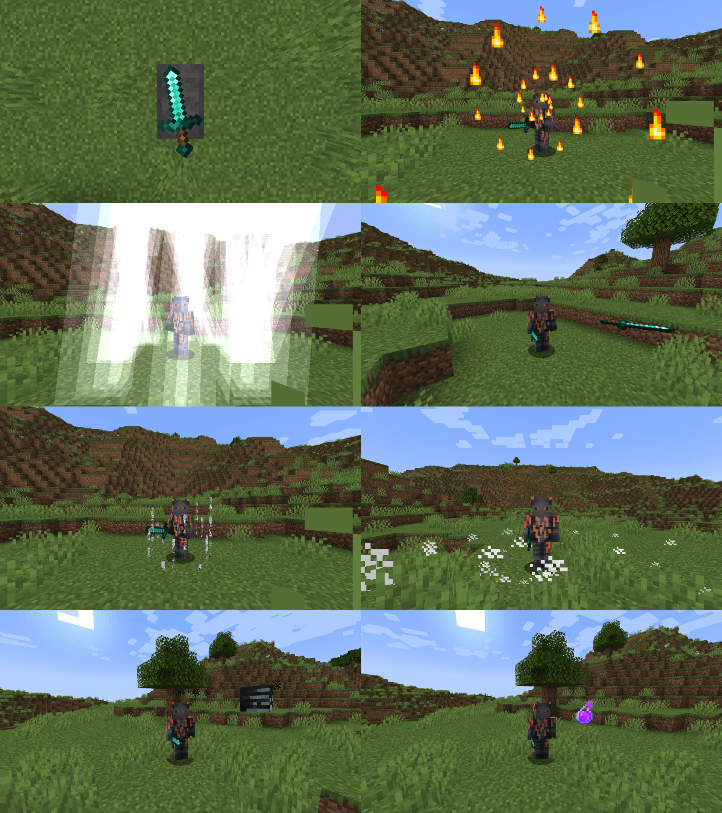

# Reforging

Reforging is a new mechanic for enhancing combat experience. Reforges provide various stat boosts and unique abilities. Reforges are obtained on a reforging anvil using ingredients.

## Why this plugin?

Make your server unique by creating your own reforges from scratch. All abilities are highly customizable with numerous properties.

## Showcase



## Commands

| Name | Description | Permission | Aliases |
| --- | --- | --- | --- |
| /reforge &lt;id&gt; | Reforges the weapon in the main hand of the player | reforging.command.reforge | N/A |
| /reloadreforging | Reloads the configuration files | reforging.command.reloadreforging | /rr |

### Abilities

<!-- <abilities> -->
<!-- </abilities> -->

## FAQ

### How to get a reforging anvil?

Craft reforging anvil with the configured recipe.

### How to reforge a weapon?

1. Right-click with the weapon on a reforging anvil
2. Right-click with the corresponding ingredient on the reforging anvil

The reforging anvil will consume the configured amount of ingredient(s). The weapon will drop with the reforge applied.

### What are the ingredients?

Most reforges use as an ingredient the material of the weapon (e.g., diamond(s) for a diamond sword). More powerful reforges use unique stones as ingredients.

### How to get a reforge stone?

Craft reforge stones with the configured recipes.

### How to activate an ability?

Right-click with the reforged weapon in your hand.

## Support

If you encounter a bug, please report it on the GitHub issue tracker.

## Configuration

Reforging uses JSON as its configuration language. Please use https://jsonlint.com/ or similar websites to validate your configuration files, as any syntax errors will result in a crash.

### Placeholders

Lots of strings can have colors and placeholders. Specify colors with `%color_name%` or `%#rrggbb%`. Specify placeholders with `%placeholder_name%`.

### Primitives

| Type | Description | Example |
| --- | --- | --- |
| `int` | An integer from $-2^{31}$ to $2^{31}-1$ | `7` |
| `long` | An integer from $-2^{63}$ to $2^{63}-1$ | `9` |
| `double` |A double-precision floating point number | `9.7` |
| `boolean` | Either `true` or `false` | `true` |
| `char` | A character | `"a"` |
| `Object` | Anything | `6` |
| `String` | A sequence of characters | `"Hello, World!"` |
| `Expression` | A mathematical expression | `"2cos(2t)"` |
| `UUID` | A universally unique identifier | `"b74413ae-d8a7-4025-8dc7-60ca8b65f979"` |
| `Enchantment` | An enchantment of the form `"minecraft:id"` | `"minecraft:sharpness"` |
| `PotionEffectType` | A potion effect type of the form `"minecraft:id"` | `"minecraft:strength"` |

### Enumerations

| Type | Values |
| --- | --- |
| `Attribute` | https://hub.spigotmc.org/javadocs/spigot/org/bukkit/attribute/Attribute.html |
| `AttributeModifier.Operation` | https://hub.spigotmc.org/javadocs/spigot/org/bukkit/attribute/AttributeModifier.Operation.html |
| `EquipmentSlot` | https://hub.spigotmc.org/javadocs/spigot/org/bukkit/inventory/EquipmentSlot.html |
| `Material` | https://hub.spigotmc.org/javadocs/bukkit/org/bukkit/Material.html |
| `EntityType` | https://hub.spigotmc.org/javadocs/bukkit/org/bukkit/entity/EntityType.html |

### `List<E>`

```
[E, E, ...]
```

```json
[7, 9]
```

### `Map<K, V>`

```
{
  K: V,
  K: V,
  ...
}
```

```json
{
  "key1": "value1",
  "key2": "value2"
}
```

### `Multimap<K, V>`

```
{
  K: [V, V, ...],
  L: [V, V, ...],
  ...
}
```

```json
{
  "key1": ["value11", "value12"],
  "key2": ["value12", "value22"]
}
```

### `Price`

| Name | Type | Description |
| --- | --- | --- |
| health | `double` | The amount of health |
| food | `int` | The amount of food |

```json
{
  "health": 4.5,
  "food": 4
}
```

### `Function2`

| Name | Type | Description |
| --- | --- | --- |
| x | `Expression` | The x coordinate based on the parameter `t` |
| z | `Expression` | The z coordinate based on the parameter `t` |
| min | `double` | The starting value of the parameter `t` |
| max | `double` | The ending value of the parameter `t` |
| delta | `double` | The step of the parameter `t` |

```json
{
  "x": "3cos(t)",
  "z": "3sin(t)",
  "min": 0,
  "max": 6.28318530718,
  "delta": 0.39269908169
}
```

### `Function3`

| Name | Type | Description |
| --- | --- | --- |
| x | `Expression` | The x coordinate based on the parameter `t` |
| y | `Expression` | The y coordinate based on the parameter `t` |
| z | `Expression` | The z coordinate based on the parameter `t` |
| min | `double` | The starting value of the parameter `t` |
| max | `double` | The ending value of the parameter `t` |
| delta | `double` | The step of the parameter `t` |

```json
{
  "x": "3cos(t)",
  "y": "3sin(t)",
  "z": "1.5t",
  "min": 0,
  "max": 6.28318530718,
  "delta": 0.39269908169
}
```

### `Vector`

| Name | Type | Description |
| --- | --- | --- |
| x | `double` | The x coordinate |
| y | `double` | The y coordinate |
| z | `double` | The z coordinate |

```json
{
  "x": 1.5,
  "y": 4.5,
  "z": 8.5
}
```

### `AttributeModifier`

| Name | Type | Description | Optional | Default |
| --- | --- | --- | --- | --- |
| uuid | `UUID` | The unique identifier  | Yes | Random |
| name | `String` | The name | No | N/A |
| amount | `double` | The amount  | No | N/A |
| operation | `AttributeModifier.Operation` | The operation | Yes | `ADD_NUMBER` |
| slot | `EquipmentSlot` | The equipment slot | Yes | All |

```json
{
  "uuid": "b74413ae-d8a7-4025-8dc7-60ca8b65f979",
  "name": "generic_max_health",
  "amount": 0.5,
  "operation": "MULTIPLY_SCALAR_1",
  "slot": "CHEST"
}
```

### `ItemWrapper`

| Name | Type | Description | Optional | Default |
| --- | --- | --- | --- | --- |
| material | `Material` | The material  | No | N/A |
| amount | `int` | The amount | Yes | `1` |
| name | `String` | The name, can have colors  | Yes | Client-side |
| lore | `List<String>` | The lore, can have colors  | Yes | None |
| enchants | `Map<Enchantment, Integer>` | The enchantments with their levels | Yes | None |
| flags | `ItemFlag` | The flags | Yes | None |
| unbreakable | `boolean` | Whether the item should be unbreakable | Yes | `false` |
| attributeModifiers | `Multimap<Attribute, AttributeModifier>` | The attribute modifiers | Yes | None |
| persistentData | `Map<String, Object>` | The persistent data | Yes | None |

```json
{
  "material": "DIAMOND_SWORD",
  "name": "%gold%Excalibur",
  "lore": ["%gold%A legendary sword!"],
  "enchants": {
    "minecraft:sharpness": 5,
    "minecraft:knockback": 2
  },
  "flags": ["HIDE_UNBREAKABLE"],
  "unbreakable": true,
  "attributeModifiers": {
    "GENERIC_MAX_HEALTH": [
      {
        "name": "generic_max_health",
        "amount": 10
      }
    ]
  },
  "persistentData": {
    "id": "EXCALIBUR"
  }
}
```

### `Recipe`

| Name | Type | Description |
| --- | --- | --- |
| shape | `List<String>` | The shape of the recipe of the form `["aaa", "aaa", "aaa"]`, where letters correspond to some ingredient |
| ingredients | `Map<char, Material>` | The ingredients of the recipe |

```json
{
  "shape": [
    "ddd",
    "ddd",
    "ddd"
  ],
  "ingredients": {
    "d": "DIAMOND"
  }
}
```

### `EntityBuilder`

| Name | Type | Description | Optional | Default |
| --- | --- | --- | --- | --- |
| attributeModifiers | `Multimap<Attribute, AttributeModifiers>` | The attribute modifiers | Yes | None |
| persistentData | `Map<String, Object>` | The persistent data | Yes | None |
| type | `EntityType` | The type  | No | N/A |
| name | `String` | The name, can have colors | Yes | `""` |
| health | `double` | The health  | Yes | Maximum |
| nameVisible | `boolean` | Whether the name should be visible | Yes | `false` |
| gravity | `boolean` | Whether the entity should be affected by gravity | Yes | `true` |
| ai | `boolean` | Whether the entity should have AI | Yes | `true` |
| invisible | `boolean` | Whether the entity should be invisible | Yes |`false` |
| glowing | `boolean` | Whether the entity should glow | Yes | `false` |
| canPickupItems | `boolean` | Whether the entity should be able to pick up items | Yes | `false` |
| visualFire | `boolean` | Whether the entity should look as if it is on fire | Yes | `false` |
| adult | `boolean` | Whether the entity should be an adult | Yes | `false` |
| helmet | `ItemWrapper` | The helmet | Yes | None |
| chestplate | `ItemWrapper` | The chestplate | Yes | None |
| leggings | `ItemWrapper` | The leggings | Yes | None |
| boots | `ItemWrapper` | The boots | Yes | None |
| itemInMainHand | `ItemWrapper` | The item in the main hand | Yes | None |
| itemInOffHand | `ItemWrapper` | The item in the offhand | Yes | None |

```json
{
  "type": "ZOMBIE",
  "name": "%blue%Frozen Baby Zombie",
  "nameVisible": true,
  "gravity": false,
  "ai": false,
  "glowing": true,
  "adult": false,
  "helmet": {
    "material": "LEATHER_HELMET"
  }
}
```

### `item.json`

| Name | Type | Description |
| --- | --- | --- |
| name | `String` | The names of all reforged weapons, can have colors and placeholders |
| lore | `List<String>` | The lore attached to all reforged weapons, can have colors and placeholders |

#### Placeholders

| Name | Description | Example |
| --- | --- | --- |
| reforge_name | The name of the reforge | Withered |
| name | The name of the weapon | Diamond Sword |
| base_attack_speed | The base attack speed of the weapon | 1.6 |
| base_attack_damage | The base attack damage of the weapon | 7 |
| generic_max_health | The max health provided by the reforge | 10 |
| generic_knockback_resistance | The knockback resistance provided by the reforge | 1 |
| generic_movement_speed | The movement speed provided by the reforge | 0.1 |
| generic_armor | The armor provided by the reforge | 5 |
| generic_armor_toughness | The armor toughness provided by the reforge | 3 |
| generic_attack_knockback | The attack knockback provided by the reforge | 1 |

<!-- <item_json> -->
<!-- </item_json> -->

### `reforge_stones.json: List<ReforgeStone>`

| Name | Type | Description |
| --- | --- | --- |
| id | `String` | The identifier of the reforge |
| item | `ItemWrapper` | The item |
| recipe | `Recipe` | The crafting recipe |

<!-- <reforge_stones_json> -->
<!-- </reforge_stones_json> -->

### `reforge_weights.json: Map<String, double>`

| Key | Value |
| --- | --- |
| The identifier of the reforge | The relative Weight |

<!-- <reforge_weights_json> -->
<!-- </reforge_weights_json> -->

### `reforges.json: List<Reforge>`

| Name | Type | Description | Optional |
| --- | --- | --- | --- |
| id | `String` | The identifier | No |
| name | `String` | The name | No |
| attributes | `Map<Attribute, double>` | The attributes with their amounts | No |
| ability | `String` | The identifier of the ability | Yes |

<!-- <reforges_json> -->
<!-- </reforges_json> -->

### `reforging_anvil.json`

| Name | Type | Description |
| --- | --- | --- |
| item | `ItemWrapper` | The item |
| recipe | `Recipe` | The crafting recipe |
| sound | `PlayableSound` | The sound played during reforging |
| price | `int` | The number of ingredients consumed during reforging |

<!-- <reforging_anvil_json> -->
<!-- </reforging_anvil_json> -->

### `abilities.json: List<Ability>`

| Name | Type | Description |
| --- | --- | --- |
| base | `String` | The base from which to inherit other properties |
| id | `String` | The identifier |

<!-- <abilities_json> -->
<!-- </abilities_json> -->

### Bases

<!-- <bases> -->
<!-- </bases> -->